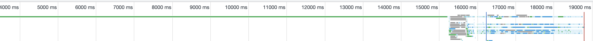
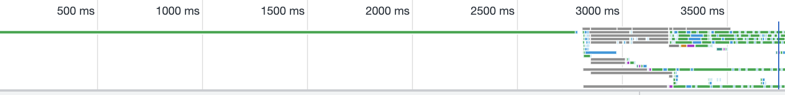
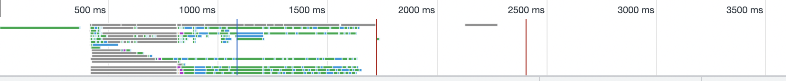

<p>
저는 현재 장고, 장고 템플릿으로 만들어진 서비스를 개선하고 있습니다.<br>
작업을 하면서 새로고침을 자주 하게 되는데 index 페이지의 로딩속도가 매우 느렸습니다.<br>
개발자 도구의 네트워크 탭에서 측정을 해보니 첫 화면이 그려지기 까지(흰 화면에서 벗어나기 까지)<br>

> 로컬 서버 기준 - 평균 15000ms ~ 15500ms<br>
> 배포 서버 기준 - 평균 3000ms ~ 3500ms<br>

의 시간이 걸렸습니다.<br>

</p>


<small>
⇧ 로컬 서버 (개선 전)
<br>
(개선 후 배포까지 마치고 작성하는 게시글 이기에 배포 서버 스크린샷은 미처 찍지 못하였습니다..😢)
</small>

<p>
로컬 서버와 배포 서버의 속도 차이가 나는 이유는 django의 디버깅 툴 유무 때문이라고 알고 있습니다.<br>
<br>
아무튼, 앞으로도 새로고침을 계속 해야할텐데 계속 이런식으로 느리면 속이 터져 죽을것 같아 개선해 보기로 하였습니다.

</p>

<p>
현재 index 페이지에는 게시글과 상품을 카테고리별로 card 형태의 swiper-slide로 보여주고 있습니다.<br>
한 눈에 봐도 가져오는 데이터가 많아 보였습니다.<br>
<br>
코드를 보면서 제 나름대로 원인을 생각한 결과는 다음과 같습니다.<br>

1. 쿼리 속도가 느리다.
2. 장고 템플릿 내부에서 for문이 많다.
3. 이미지의 크기가 크다

하나씩 해결해보도록 하겠습니다.

 </p>

### 쿼리 속도가 느리다.

제일 먼저 index 페이지의 쿼리 속도를 측정해보았습니다.

> Number of Queries : 507<br>
> Finished in : 8.52s

쿼리 호출 수가 507.. 무려 8초나 걸리는 것을 볼 수 있습니다. <br>
우선 쿼리 호출 수 부터 줄이는 것을 목표로 구글링을 해보았습니다.<br>

django에는 Queryset이라는 것이 존재하는데 이것은 세가지의 특징이 있습니다.

1. Lazy Loading
2. Caching
3. Eager Loading

간단히 설명하면<br>
Lazy Loading - 코드 한줄 한줄마다 쿼리를 호출하는 것이 아닌 모든 처리가 끝난 후에 종합하여 실행하는 개념<br>
Eager Loading - Lazy Loading에 반대되는 개념으로 Lazy Loading에서 생기는 N + 1 문제를 해결하기 위해 사용하는 방법 <br>
Caching - 쿼리셋을 재사용하여 쿼리 숫자를 줄일 수 있는 방법<br>
이것을 잘 활용하는 것이 성능 측면에서 중요하다고 합니다.<br>

이제 작성되어 있는 index 페이지의 백엔드 코드를 살펴보면<br>

```python
//예시 코드이며 실제 코드와는 다릅니다.

sell_posts = Post.objects.filter(
    Q(post_type=PostType.SELL) & Q(state=State.ACTIVE)
).order_by('-created_at')
buy_posts = Post.objects.filter(
    Q(post_type=PostType.BUY) & Q(state=State.ACTIVE)
).order_by('-created_at')

header_banners = Banner.objects.filter(
    Q(banner_type=BannerType.HEADER) & Q(state=State.ACTIVE)
).order_by('-created_at')

footer_banners = Banner.objects.filter(
    Q(banner_type=BannerType.FOOTER) & Q(state=State.ACTIVE)
).order_by('-created_at')

...some code...

```

위와 같이 되어있었습니다.<br>
위의 3가지 특징을 잘 활용하여 변경을 해보도록 하겠습니다.<br>
<br>
제일 먼저 비슷한 쿼리셋이 눈에 띄는데, 이것들을 변수에 담아서 재사용 해보도록 하겠습니다.<br>

```python
//예시 코드이며 실제 코드와는 다릅니다.

posts_queryset = Post.object.filter(Q(state=State.ACTIVE)).order_by('-created_at')

sell_posts = posts_queryset.filter(Q(post_type=PostType.SELL))
buy_posts = posts_queryset.filter(Q(post_type=PostType.BUY))

banner_queryset = Banner.objects.filter(Q(state=State.ACTIVE)).order_by('-created_at')

header_banners = banner_queryset.filter(Q(banner_type=BannerType.HEADER))
footer_banners = banner_queryset.filter(Q(banner_type=BannerType.FOOTER))

...some code...

```

이런식으로 전부 변경 후 다시 측정해보았습니다.<br>

> Number of Queries : 507<br>
> Finished in : 8.91s

...?<br>
조금이라도 줄어들 줄 알았는데 하나도 변한게 없네요..<br>
제가 뭔가 잘못 이해하고 있는걸까요?<br>
변수에 저장을 하더라도 다른 Filter를 사용하면 새로 호출하는 것 같습니다.. <br>
자세한 내용은 추후 더 공부해보아야 할 것 같아요 <br>
<br>
그 다음에 보이는 문제점은 <br>
post에는 author라는 외래키를 가지고 있고, 다대다 관계에 있는 데이터도 있습니다.<br>
예시코드에는 나와있지 않지만 상품에도 다양한 외래키와 다대다 관계가 있습니다.<br>
<br>
쿼리셋의 특징 중 하나인 Lazy Loading은 모든 명령을 종합하여 마지막에 실행 하기 때문에 중복되는 쿼리 호출을 막아주는 장점이 있지만,<br>
단점은 외래키, 다대 다 관계에 있는 데이터들을 호출할 때 그 갯수만큼 쿼리를 호출하는 N + 1 문제가 발생하는 것 입니다.<br>
예를들어 post 100개를 가져오면 각 post의 외래키 관계인 author도 조회를 해야 하므로 100개의 쿼리를 추가로 호출하게 되고 이는 성능을 저하시킵니다. <br>
<br>
이 문제를 해결하기 위해 Eager Loading이라는 방법이 있습니다.<br>
사전에 미리 필요한 데이터를 가져오는 방식인데, 장고에서는 select_related와 prefatch_related 라는 메소드로 구현해두었습니다.<br>
[select_related] 와 [prefatch_related]의 차이는 공식문서로~

[select_related]: https://docs.djangoproject.com/en/4.0/ref/models/querysets/#select-related
[prefatch_related]: https://docs.djangoproject.com/en/4.0/ref/models/querysets/#prefetch-related

<br>
select_related 와 prefatch_related를 사용하여 코드를 변경해보겠습니다.

```python
//예시 코드이며 실제 코드와는 다릅니다.

posts_queryset = (
    Post.object
    .filter(Q(state=State.ACTIVE))
    .order_by('-created_at')
    .select_related("author")
    .prefetch_related("categories")
)

sell_posts = posts_queryset.filter(Q(post_type=PostType.SELL))
buy_posts = posts_queryset.filter(Q(post_type=PostType.BUY))

banner_queryset = (
    Banner.objects
    .filter(Q(state=State.ACTIVE))
    .order_by('-created_at')
)

header_banners = banner_queryset.filter(Q(banner_type=BannerType.HEADER))
footer_banners = banner_queryset.filter(Q(banner_type=BannerType.FOOTER))

...some code...

```

요로코롬 외래키와 관계가 있는 모델들을 전부 Eager Loading 하도록 변경하였습니다.
그 후 다시 측정을 해보았습니다

> Number of Queries : 57<br>
> Finished in : 1.86s

와! 쿼리 수가 507개에서 57개로 눈에 띄게 줄어들었습니다.<br>
8~9초가 걸리던 속도도 2초 전후로 바뀌었습니다.<br>
<br>
브라우저 개발자 도구 네트워크 탭에서도 눈에 띄는 변화가 생겼습니다.<br>


<small>⇧ 로컬 서버(개선 후)</small>


<small>⇧ 현재 배포 서버(개선 후)</small>

평균 15000ms ~ 15500ms

> 로컬 서버 기준 : 평균 15000ms \~ 15500ms => 평균 2500ms \~ 3500ms<br>
> 배포 서버 기준 : 평균 3000ms \~ 3500ms => 평균 400ms \~ 500ms

이것으로 쿼리 속도 개선을 마쳤습니다.<br>
캐싱은 왜 안된 것 인지 추가로 좀 더 쿼리를 줄일 수는 없는지 공부해 보아야 하지만 파이썬 장고를 처음 써보는 입장에서 매우 만족스럽습니다.<br>
<br>
원래 계획은 한 글에 다 적을 계획이였는데 생각보다 글이 길어져서 나눠 쓰도록 하겠습니다.<br>
인생 살면서 이렇게 길게 글을 써본 적이 없어서 남들에게 잘 읽힐지는 모르겠습니다..ㅎㅎ<br>
점점 발전하는 모습 지켜봐주세요 감사합니다.
