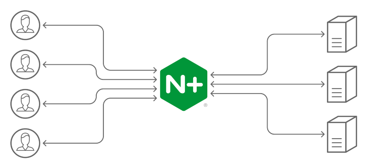

안녕하세요.<br>
1주일에 게시글 하나씩은 올리려고 다짐했으나..<br>
벌써 2주정도가 지나버렸습니다. 정신 차리겠습니다..<br>
<br>

## 개요

저희 회사에는 실제로 운영하는 product 서버,<br>
내부에서 Q/A 하는 용도의 develop 서버가 있습니다.<br>
<br>
이슈나 개선사항 같은 것들을 개발하여 develop 서버에 배포 하고 Q/A를 마치고 product서버에 배포하는 흐름으로 개발을 하고 있습니다.<br>
처음 왔을 때 기존의 개발자분들이 배포를 직접 터미널에서 ssh로 서버에 접속해서 수동으로 하시고 있었습니다.<br>
<br>
그래서 제가 한번 develop 서버 배포를 자동화 시켜보겠습니다 하고 github action을 사용하여 develop 서버에 배포하는 과정을 간단하게 자동화를 하였습니다.<br>
develop 서버는 docker 같은 것을 사용하지 않았고 반영사항을 pull하고 start만 해주면 되는 간단한 프로세스였기에 금방 할 수 있었습니다.<br>
<br>
develop 서버는 간단하게 구성하였지만 <br>
product 서버는 배포할 때 2 ~ 3초의 서버 다운이 생기기 때문에 이걸 해결해 달라는 요구사항이 있어서 바로 자동화하진 못했고, 그렇게 어영부영 시간이 지나다 보니 이제서야 자동화를 해보려고 합니다.
<br>

## nginx

무중단 배포를 구성하기 위해서 nginx의 로드밸런싱 기능을 사용하려고 합니다.<br>



로드밸런싱이란 외부에서 들어온 요청을 여러 개의 서버로 적절히 나누어서 처리하고, 하나의 서버가 다운이 되면 다른 온라인 서버로 요청을 리디렉션 하는 것이라고 합니다.<br>
<br>
위의 로드밸런싱을 활용하여 기존 서버를 유지한 채 신규 서버를 구성하여 두 개의 서버로 나눠서 요청을 받다가, 기존의 서버 인스턴스를 닫고 신규 서버로 모든 요청을 돌리는 방식으로 서버의 중단이 없는 배포 방식을 구성하려고 합니다.<br>
<br>
nginx에서 로드밸런싱을 하려면 설정을 해주어야 합니다.<br>
가장 기본적인 설정 파일은 보통 etc/nginx/nginx.conf 파일이고<br>
nginx.conf 파일에 모두 작성해도 되지만, 다른 .conf 파일을 만들고 inclue하여 사용할 수 있습니다.<br>
<br>
우선 기본적인 nginx.conf 파일을 보면

```
// nginx.conf

worker_processes  1;

events {
    worker_connections  1024;
}

http {
    include       mime.types;
    server {
        listen       80;
        location / {
            root   html;
            index  index.html index.htm;
        }
    }
}
```

이런식으로 구성이 되어있습니다.<br>
설정을 제 나름대로 풀어보면, <br>
최대 사용자 수는 1 \* 1024(worker_processes \* worker_connections ) 이고,<br>
서버의 80번 포트로 요청이 오면 index.html 파일을 서빙해준다. <br>
인 것 같습니다. <br>
<br>
각각의 지시어에 대해서는 구글선생님이 친절하게 알려주시기 때문에..<br>
아무튼, 저는 이 nginx.conf를 이런식으로 작성하였습니다<br>
<br>

```
worker_processes auto;

events {
  worker_connections 1024;
}

http {
  charset utf-8;
  include mime.types;

  include conf.d/*.conf;
}
```

worker_processes는 서버의 코어 수 만큼 할당하는 것이 보통이지만 auto로 하여도 무방하다 하여 auto로 지정하였고,<br>
charset은 한국어 깨짐 문제를 방지하기 위해서 사용하였습니다. <br>
<br>
여기까지가 nginx의 기본 설정이고 그 외의 로드밸런싱 설정은 .conf 파일을 따로 만들어서 작성하였습니다.<br>
위의 nginx.conf의 맨 아랫줄에 inclue하는 부분에서 아래의 mysite.conf 파일을 불러와서 적용시킵니다.
<br>

```
// conf.d/mysite.conf

upstream django-server {
        server 127.0.0.1:8000;
        server 127.0.0.1:8001;
}

server {
    listen 80;
    server_name mysitedomain.com;
    client_max_body_size 20M;

    location / {
        proxy_pass http://django-server;
    }

    location /static/ {
            alias /code/static_root/;
    }

    location /media/ {
            alias /code/media/;
    }
}

```

nginx의 로드밸런서를 사용하기 위해서는 upstream이라는 지시어에 이름을 지어주고 그 안에 서버들의 [호스트:포트]를 적어주어야 합니다.<br>
<br>
그리고 아래의 server 블럭에는 프록시 설정을 해준 것인데,<br>
80번 포트를 통하여 요청을 보내면 위에서 정해준 upstream 서버들에게 요청을 분배해줍니다.<br>
<br>
그 외에는 각 location에 해당하는 경로로 요청을 했을때 alias 경로로 변환하여 찾아주는 설정입니다.<br>
<br>
이제 두 서버중 하나가 다운이 되어도 다른 온라인 서버로 연결되어 사용자가 중단없이 사용할 수 있을 것 입니다.<br>
<br>
다음 포스팅은 docker-compose를 사용하여 django, gunicorn 컨테이너와 nginx 컨테이너를 연결하는 작업을 할 예정입니다. <br>
<br>
부족한 글 읽어주셔서 감사합니다
