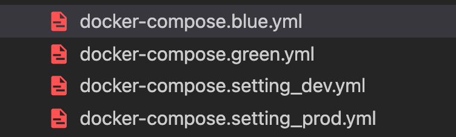

이번 포스팅은 도커에 대한 튜토리얼은 아닙니다.<br>
도커에 대한 튜토리얼은 공식 문서나, 다른 블로그에서도 많이 소개가 되어있으니 참고 부탁드립니다.<br>
저는 도커파일과 컴포즈 파일을 작성하면서 왜 이렇게 작성했는지에 대해서 작성하였습니다.<br>
<br>
blue-green 방식의 무중단 배포를 구현하려면 인스턴스를 2개를 띄워야 합니다.<br>
그 점에서 도커가 손쉽게 동일한 환경을 유지하면서 여러개를 띄울 수 있어서 사용하고 있습니다.<br>

### Dockerfile

```
FROM python:3.9.5-slim-buster
ENV PYTHONUNBUFFERED 1
RUN apt-get update \
    && apt-get -y install libpq-dev gcc \
    && pip install psycopg2
WORKDIR /code
COPY requirements.txt .
RUN pip install -r requirements.txt
COPY . .
RUN chmod +x ./docker-entrypoint.sh
ENTRYPOINT ["./docker-entrypoint.sh"]
```

베이스 이미지는 python:3.9.5-slim-buster 사용하였습니다.<br>
기존에는 python:3.9.5-buster를 사용하였는데 이번 기회에 이미지의 사이즈를 줄이기 위해 slim 버전으로 바꾸었습니다.<br>
alpine이라는 더 작은 사이즈의 이미지가 있지만 어느 [아티클][article]을 보고 slim을 사용하기로 결정하였습니다.<br>

사이즈는 2GB에서 1.5GB로 다소 감소하였습니다.<br>
slim 버전으로 바꾸었을때 pip install 하면 psycopg2 설치부분에서 에러가 났었는데, 3번째줄 커맨드를 추가해주니 정상 동작 하였습니다.<br>
<br>
WORKDIR은 nginx의 경로와 동일하게 지정해주었습니다. 추후 이 경로에 static 파일 폴더가 생성됩니다.<br>
<br>
docker-entrypoint.sh 는 쉘 스크립트 파일인데, 마이그레이션과 스태틱 파일 정리 명령어가 들어있습니다.

```
# docker-entrypoint.sh

# Collect static files
echo "::: Collect static files :::"
python manage.py collectstatic --noinput

echo "::: Apply database migrations :::"
python manage.py migrate
```

이제 docker-compose 파일들을 살펴보겠습니다.<br>
파일"들"이라고 한 이유는 저는 docker-compose 파일을 4개로 쪼갰습니다.<br>



기존 한개의 docker-compose 파일에서는 배포를 할 때마다 모든 service들이 새로 재시작이 되기 때문에 비효율적이라 생각하여 nginx,redis등 환경 세팅과 web을 분리하여 작성하였습니다.<br>
<br>
또, blue-green 배포 방식을 사용하기 위해 포트번호를 다르게 하여 web을 2개로 분리하였고,<br>
내부 개발서버용, 운영서버용 세팅을 분리하였습니다.

### docker-compose - blue , green

blue,green 파일은 포트 번호만 다르고 모두 동일합니다.

```
version: "3"

services:
  web:
    build: .
    command: gunicorn my_app.wsgi:application --bind 0.0.0.0:8000 --workers 8
    volumes:
      - ./static_root:/code/static_root
      - media_volume:/code/media
    environment:
      - DJANGO_ALLOWED_HOSTS=localhost 127.0.0.1 [::1]
    ports:
      - "8000:8000"
    networks:
      - settings

volumes:
  media_volume:

networks:
  settings:
    external: true

```

여기서는 위에서 만들었던 dockerfile을 가지고 빌드를 합니다.<br>
빌드가 끝나면 gunicorn을 실행시켰습니다. <br>
--bind 0.0.0.0:8000 옵션은 8000번 포트에서 실행시키겠단 의미이고,<br>
--workers 8 옵션은 gunicorn의 프로세스 수를 8개라고 정하는 것인데, 통상 서버의 코어수 \* 2 를 지정한다고 합니다.<br>
<br>
그 외에 static 폴더 경로를 지정해주고,<br>
django는 디버그 모드가 아니면 지정해 준 호스트에서만 접속이 가능하기 때문에 환경변수로 지정해주었습니다.<br>
포트는 blue는 8000번, green은 8001번으로 지정해주었습니다.<br>
<br>
제가 제일 헤맸던 부분이 networks 부분인데, <br>
이전에 한개의 docker-compose 파일을 사용하였을 때에는 별 다른 설정없이 다른 컨테이너(redis,nginx)와의 통신이 가능했었는데,<br>
docker-compose 파일을 분리를 하니, 이전처럼 service명:포트번호로 접근이 안되고, localhost, 127.0.0.1로도 안되서 검색을 해보니,<br>
docker-compose 파일마다 네트워크가 만들어지고,<br>
같은 파일이면 같은 네트워크를 공유해서 별 다른 설정없이 접근이 가능하지만,<br>
파일을 분리시키면 네트워크도 분리가 되어서 연결이 안된다고 합니다.<br>
<br>
저는 네트워크를 만들어서 모든 compose 파일이 그곳을 가리키도록 설정하도록 하였습니다.<br>
조금 있다가 설명드리겠지만 저는 docker-compose를 실행하기 전에 settings라는 네트워크를 만들어 주는 명령어를 실행하도록 하였습니다.<br>
그리고 위에 적혀있는 networks 설정이 그 네트워크를 사용하도록 하는 설정하였습니다.<br>

### docker-compose - setting

```
version: "3"

services:
  redis:
    image: redis:alpine
    ports:
      - "6379:6379/tcp"
    command: redis-server
    healthcheck:
      test: redis-cli ping
    networks:
      - settings
      - default

  celery:
    build: .
    command: celery -A my_app worker -l info
    restart: unless-stopped
    environment:
      - DJANGO_ALLOWED_HOSTS=localhost 127.0.0.1 [::1]
    depends_on:
      - redis

  celery-beat:
    build: .
    command: celery -A my_app beat -l info
    restart: unless-stopped
    environment:
      - DJANGO_ALLOWED_HOSTS=localhost 127.0.0.1 [::1]
    depends_on:
      - redis

  nginx:
    image: nginx
    ports:
      - "80:80"
    volumes:
      - ./nginx.conf:/etc/nginx/nginx.conf
      - ./mysite.conf:/etc/nginx/conf.d/mysite.conf
      - ./static_root:/code/static_root
    command: ["nginx", "-g", "daemon off;"]
    networks:
      - settings

networks:
  settings:
    external: true

```

setting 파일에서는 redis,celery,nginx가 한꺼번에 빌드되고 있습니다.<br>
위의 blue,green 처럼 networks를 settings를 사용하도록 하였고,<br>
redis에는 celery와 통신하기 위해 기존처럼 default 네트워크도 추가로 사용하도록 설정하였습니다.<br>
<br>
celery 빌드에는 기존 api서버의 도커파일을 사용합니다.<br>
왜 따로 분리가 되었는지는 자세히는 모르겠지만 관리가 좀더 수월하고,<br>
한곳에서 에러가 발생해도 나머지는 정상동작 하기 위해서 라고 알고 있습니다.<br>
<br>
nginx 설정에는 지난번 포스팅에서 만들었던 nginx.conf 파일과 mysite.conf 파일을 사용하도록 설정하고,<br>
static 파일을 서빙하기 위해 경로도 설정해주었습니다.<br>
<br>

### deploy.sh

이렇게 만들어진 docker-compose 파일로 어떻게 blue-green 무중단 배포를 진행하느냐!<br>
저는 deploy.sh 라는 쉘 스크립트 파일을 만들었습니다.

```
PROJECT_NAME=app
SETTING_SERVER=$1

EXIST_BLUE=$(docker-compose -p ${PROJECT_NAME}-blue -f docker-compose.blue.yml ps | grep -e running -e Up)
EXIST_SETTING=$(docker-compose -p setting-${SETTING_SERVER} -f docker-compose.setting_${SETTING_SERVER}.yml ps | grep -e running -e Up)
EXIST_NETWORK=$(docker network ls | grep settings)

if [ -z "$EXIST_NETWORK"]; then
    echo ":::: networks setup ::::"
    docker network create settings
fi

if [ -z "$EXIST_BLUE" ]; then
    echo ":::: blue up ::::"
    docker-compose -p ${PROJECT_NAME}-blue -f docker-compose.blue.yml up -d --build

    sleep 30

    echo ":::: green down ::::"

    docker-compose -p ${PROJECT_NAME}-green -f docker-compose.green.yml down --rmi all
else
     echo ":::: green up ::::"
    docker-compose -p ${PROJECT_NAME}-green -f docker-compose.green.yml up -d --build

    sleep 30

    echo ":::: blue down ::::"

    docker-compose -p ${PROJECT_NAME}-blue -f docker-compose.blue.yml down --rmi all
fi

if [ -z "$EXIST_SETTING"]; then
    echo ":::: setting up ::::"
    docker-compose -p setting-${SETTING_SERVER} -f docker-compose.setting_${SETTING_SERVER}.yml up -d --build
fi
```

전부 제가 작성한 것은 아니고 구글 선생님께서 알려주셨습니다..ㅎㅎ<br>
<br>
먼저, PROEJCT_NAME, SETTING_SERVER는 변수인데 <br>
그 중 SETTING_SERVER는 deply.sh를 실행할 때 매개변수를 받아서 변수에 저장하는 것 입니다.<br>
저는 세팅 컴포즈 파일명 뒷부분 prod, dev를 매개변수로 받아서 각 서버마다 다르게 실행될 수 있도록 하였습니다.<br>
<br>
그 후 settings 네트워크가 만들어져 있는지 검사하여 없으면 생성하고,<br>
blue 컨테이너가 있는지 검사하여 있으면 green 컨테이너 배포 후 30초 후에 blue 컨테이너를 끄고 없으면 반대로 동작하도록 하였습니다.<br>
마지막엔 세팅이 이미 되어있는지 검사 후 없으면 실행하도록 하였습니다.<br>
세팅을 제일 마지막에 둔 이유는 <br>
이전 포스팅 nginx의 mysite.conf 파일에서 호스트를 web으로 설정을 하였는데 web이 먼저 켜져있는 상태가 아니면 실행되자마자 뻗어버리기 때문입니다.<br>
<br>
이렇게 작성을 마쳤습니다. <br>
이제 배포할 서버에 들어가서 ./deploy.sh prod 라는 커맨드만 입력해주면 배포가 완료됩니다!
<br>
<br>
다 적고나니 너무 글만 적혀있어서 지루한 감이 없지않아 있는 것 같습니다..ㅎㅎ<br>
너무 요약도 없이 주절주절 적혀있는 것도 그렇고.. 글쓰는게 참 어렵네요 <br>
여러분들이 보시기에 더 개선해야 할 점이 있다면 꼭 알려주시면 감사하겠습니다.<br>

[article]: https://pythonspeed.com/articles/alpine-docker-python/
