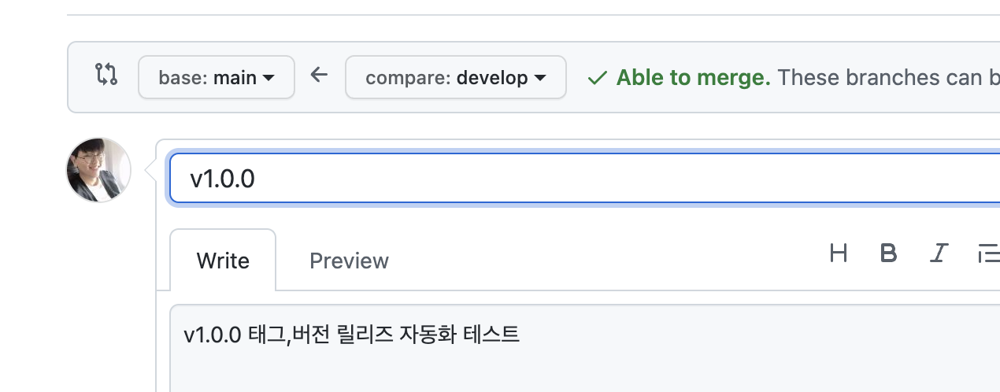
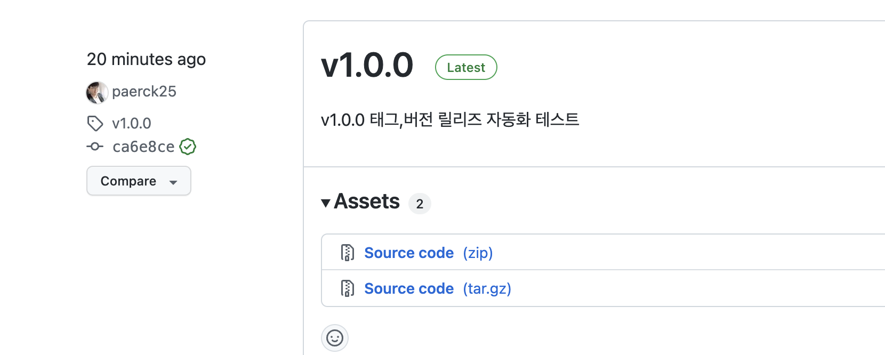

저희 레포지토리는 main 브랜치와 develop 브랜치를 나눠서 develop 브랜치에서 테스트, QA를 다 마치고 release할 때만 main 브랜치에 올리는 방식으로 배포를 하고 있습니다.<br>
<br>
얼마 전에 develop 브랜치에서 테스트를 다 마치고 main 브랜치에 올려서 배포를 하였는데, 어째선지 500 에러를 뱉어내며 제대로 동작하지 않았습니다.<br>
계속 원인을 찾아보다가 도저히 못 찾겠어서 롤백을 하려 했는데 여태 release 버전 관리를 해오지 않아서 이전 버전의 커밋이 어디까지인지 몰라 롤백조차도 제대로 하지 못하였습니다.<br>
<br>
결국, 원인을 찾았지만(코드 문제가 아닌 db의 문제), 거의 30~40분 동안 서비스가 중지가 되버렸습니다.<br>
추후 이런일이 없도록 버전 관리를 해야만 하겠다고 생각이 들었고,<br>
수동으로 하면 귀찮으니 자동화를 하였습니다.

## Github Action 워크플로우

얼마전에 무중단 배포를 구축할때도 사용하였지만<br>
한번 사용법을 익혀두니까 여러모로 잘 써먹고 있는 것 같습니다.

```
name: Create Release

on:
    pull_request:
        types: [closed]
        branches:
            - main

jobs:
    create-relase:
        if: github.event.pull_request.merged == true
        runs-on: ubuntu-latest
        steps:
            - name: Checkout code
              uses: actions/checkout@master
            - name: Create Release
              id: create_release
              uses: actions/create-release@v1
              env:
                  GITHUB_TOKEN: ${{ secrets.GIT_AUTH_TOKEN }}
              with:
                  tag_name: ${{ github.event.pull_request.title }}
                  release_name: ${{ github.event.pull_request.title }}
                  body: ${{ github.event.pull_request.body }}

```

생각보다 간단하게 작성할 수 있었습니다.<br>
<br>
먼저, 트리거를 보시면 main 브랜치에 올라온 pull_request가 closed 되었을 때 실행되도록 작성하였습니다.<br>
트리거로 [push]를 사용하지 않은 이유는 아래에서 pull_request의 title로 태그와 릴리즈를 만들기 때문에, main 브랜치에 바로 push하는 커밋들에는 실행되지 않았으면 하였습니다.<br>
<br>
그리고 jobs를 보시면 pull_request가 merge가 되었을 때만 실행되도록 if 조건을 걸어두었습니다.<br>
이걸 해두지 않으면 PR을 올리고 모종의 이유로 PR을 merge하지 않고 close하였을 때도 실행이 되므로 그것을 방지하였습니다.<br>
<br>
그 외에는 레포지토리에 Secret Key를 GIT_AUTH_TOKEN 이라는 이름으로 등록하여 사용하였고, 태그명,버전명, 내용은 pull_request와 같도록 작성하였습니다.

## 테스트



main 브랜치로 Pull Request를 작성할 때 버전을 쓰고, 내용을 채운 후


머지를 하면



이렇게 태그와 버전이 생성되었습니다.
<br>
<br>
