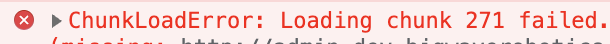

## Nginx 404

리액트 프로젝트를 빌드 후 nginx로 띄워봤습니다.<br>
얼핏 보면 정상적으로 동작 하는 것 같았지만 한 단계 경로를 거친 상태에서 새로고침을 하니<br>
404 페이지가 나타났습니다.<br>
구글링 결과,

> 처음 index 페이지에 접근 한 후의 경로 변경은 브라우저 자체에서 처리되지만,<br>
> 한 단계 경로를 거친 상태로 새로 고치거나 새로 열면 요청이 nginx쪽에서 경로가 없는 곳으로 이동하기 때문에 404 페이지가 표시된다.

라고 합니다. 때문에 nginx.conf 설정을 바꾸어 주어야 하는데,

```
location / {
        root   /usr/share/nginx/html;
        index  index.html index.htm;
        try_files $uri $uri/ /index.html;  <-- 이 항목을 추가해 주어야 합니다.
}
```

이것은 nginx에서 지정된 uri에서 찾을 수 없으면 index.html 브라우저로 보낸다고 합니다.

## ChunkLoadError

위와 같이 빌드 후에 "example.com/a" 경로까지는 정상적으로 화면이 나타났지만,<br>
"example.com/a/:id" 경로에 접근하니 흰 화면을 띄우며 콘솔창에는



이러한 에러가 나타났습니다.<br>
<br>
"/a" 경로까지는 정상적으로 나타나길래 react-router 사용이 잘못되었나 싶어 이리 고치고 저리 고쳐봤지만 소용이 없었습니다.<br>
<br>
계속 삽질하는 와중에 React.Lazy를 함부로 사용하면 안된다는 글을 보고 혹시나 싶어 지워봤더니 정상동작은 하였지만, code-splitting은 하고 싶었고, 이런 해결로는 찝찝함이 가시지가 않아서 계속 구글링 한 결과,
<br>
package.json의 homepage 라는 필드를 지우면 된다는 스택오버플로우 글을 보고

```
"homepage" : ".",
```

이렇게 되어있던 부분을 지워봤더니 React.Lazy를 사용한 채로도 정상 동작이 되었습니다.<br>
<br>
무슨 원리인가 싶어 찾아보니 package.json의 homepage가
리액트의 PUBLIC_URL 환경변수에 영향을 주어, 경로가 바뀌는 것 같았습니다.<br>
<br>
하지만 아직 의문인건 PUBLIC_URL이 바뀌었으면 왜 "/a"경로까지는 정상적으로 나타났는지...<br>
아시는분이 계시면 댓글로 적어주시면 정말 감사하겠습니다.
