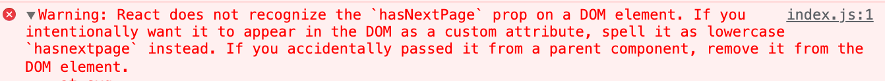

저는 react 프로젝트에서 주로 styled-components를 사용합니다. <br>
styled-components는 css-in-js 라이브러리로, javascript 코드 내에서 css를 작성할 수 있게 해주는 라이브러리 입니다.

-   css 파일을 따로 두지 않는 점
-   컴포넌트 단위로 css를 작성할 수 있는점
-   js 코드의 변수를 css 작성에 사용할 수 있다는 점

이러한 장점들이 있어 감사히 사용하고 있습니다.

## Unknown Prop Warning

```tsx
const RightArrow = styled(ArrowBase)<{ hasNextPage: boolean }>`
    margin-left: 50px;
    ${props =>
        !props.hasNextPage &&
        css`
            cursor: not-allowed;
            .fill_color {
                fill: #e5e8eb;
            }
        `}
`;

<RightArrow hasNextPage={hasNextPage} onClick={next} />;
```

styled-components에서는 css를 작성할 때, 위와 같이 props를 사용해서 작성할 수 있습니다.<br>
그렇게 계속 작성을 하던 와중에 Warning을 마주쳤습니다.<br>



> " 리액트는 'hasNextPage' 를 DOM element의 props로 인식하지 않습니다. 의도적으로 커스텀 속성으로 사용하려면 소문자인 'hasnextpage' 로 입력하세요. 만약 실수로 부모 컴포넌트에서 통과된것이라면 DOM element에서 제거하세요 "

react 공식문서에 따르면 {...this.props} 또는 cloneElement(element, this.props)를 사용하여 props를 그대로 자식 컴포넌트에 넘겨주면 발생하는 경고라고 합니다.<br>
[리액트 공식문서]

위의 RightArrow에서 ArrowBase는 svg 파일을 사용하고 있는데,<br>
svg 태그의 attribute로 hasNextPage가 없어서 나오는 경고인 것 같습니다.<br>
<br>
공식문서의 해결책으로는 data-attribute로 사용하던가, 소문자로 사용하라는 것 같은데 그렇게 하기엔 코드가 멋이 없어지는 것 같아서 좀 더 찾아보았고,<br>
당연히 styled-componenets 문서에도 문제를 알고 명시를 해두었습니다.<br>[styled-components 공식문서]

공식문서에서는 v5.1 버전부터 Transient props 라는 이름으로,

```tsx
const RightArrow = styled(ArrowBase)<{ $hasNextPage: boolean }>`
    margin-left: 50px;
    ${props =>
        !props.$hasNextPage &&
        css`
            cursor: not-allowed;
            .fill_color {
                fill: #e5e8eb;
            }
        `}
`;

<RightArrow $hasNextPage={hasNextPage} onClick={next} />;
```

해당 props 앞에 '\$' 표시를 붙이는 것으로 사용할 수 있다고 합니다.<br>
내부적으로 '\$' 를 기준으로 필터링을 하도록 처리하지 않았을까 생각합니다.<br>

[리액트 공식문서]: https://ko.reactjs.org/warnings/unknown-prop.html
[styled-components 공식문서]: https://styled-components.com/docs/api#transient-props
