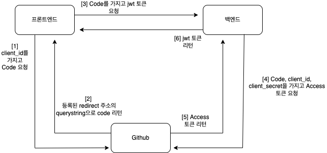
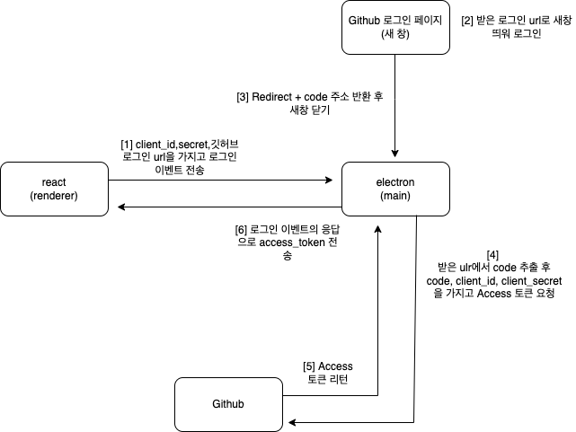

## 개요

요즘에 electron + react로 간단한 pc 앱을 만들고 있습니다.<br>
거기서 github api를 사용하는데,<br>
react로 만들긴 하지만 웹이 아닌 앱이기 때문에 알고있던 방식을 사용할 수가 없어서 조금 애를 먹었습니다.<br>
그 삽질에 대한 기록으로, electron의 튜토리얼은 아닙니다!
<br>

## Redirect URL 문제


보통의 웹에서의 OAuth 방식은 위의 흐름으로 구현을 했었는데,<br>
electron 앱에서는 빌드된 react 파일을 바로 띄워버리기 때문에, 따로 redirect 주소가 없어서 \[2\]번에서부터 막혀버렸습니다.<br>
<br>
해결책을 찾고자 구글링을 하니, 다른 사람이 만든 라이브러리가 있었지만,
저는 직접 구현해 보고 싶어서 계속 찾아보았고, 약간 얍삽이(?) 같지만 구현을 해보았습니다.<br>
<br>

## React와 Electron 사이의 통신

electron은 nodejs,chromium 으로 만들어져 있어,<br>
간단히 nodejs 부분을 main process라고 하고,<br>
chromium으로 html,css,js를 사용하여 view를 보여주는 부분을 renderer process 라고 합니다.<br>
여기서는 react가 renderer process, 프론트 부분에 해당하고,<br>
main process가 백엔드의 역할을 대신하게 됩니다.

### ipcMain, ipcRenderer

```ts
//react
ipcRenderer.on("my_name_is", e => {
    console.log(`Hello, ${e.name} !`); // "Hello, paerck25 !"
});
ipcRenderer.send("your_name");

//electron
ipcMain.on("your_name", e => {
    e.reply("my_name_is", { name: "paerck25" });
});
```

react와 electron은 electron 내부의 ipcMain, ipcRenderer를 사용하여 서로 통신하는데,<br>
websocket을 사용해보셨으면 아실법한 이벤트 방식의 통신입니다.<br>

## 구현

원래는 location.href를 사용하여 깃허브 로그인 페이지로 이동하고, 로그인을 마치면 등록된 redirect url로 redirect 되면서 같이 딸려오는 querystring으로 code를 얻었지만,<br>
<br>
electron에서는 url을 가질수가 없기 때문에, 기존 창에서 로그인을 마치고 redirect를 하면 해당 url은 존재하지 않기 때문에 흰 창이 띄워지고 아무것도 할 수 없어집니다.<br>
<br>
때문에, 슬랙이나 macOS 기본 Mail 앱을 보면 로그인을 할때 새로운 창을 띄우는 것 처럼, electron으로 깃허브 로그인 페이지 URL를 이벤트와 함께 보내서, 새창을 띄우는 방식으로 code를 얻어보려고 합니다.

```tsx
// react

const electron = window.require("electron");

useEffect(() => {
    electron.ipcRenderer.on("login-reply", (e: any, arg: AccessToken) => {
        localStorage.setItem("token", `${arg.access_token}`);
        if (navigate) navigate("/home", { replace: true });
    });
}, []);

const githubLogin = () => {
    // location.href = GET_CODE_URL;
    electron.ipcRenderer.send("login", {
        getCodeUrl: GET_CODE_URL,
        client_id: CLIENT_ID,
        client_secret: CLIENT_SECRET
    });
};

<LoginButton onClick={githubLogin} />;
```

```typescript
// electron.ts

ipcMain.on("login", async (event, arg) => {
    const REDIRECT_URL = "http://localhost/auth?code=";
    const getAccessToken = async (url: string) => {
        if (url.includes(REDIRECT_URL)) {
            const code = url.replace(REDIRECT_URL, "");
            const { data } = await axios.post(
                "https://github.com/login/oauth/access_token",
                {
                    code: code,
                    client_id: arg.client_id,
                    client_secret: arg.client_secret
                },
                {
                    headers: {
                        Accept: "application/json"
                    }
                }
            );
            return data;
        }
        return null;
    };

    const win = new BrowserWindow({ width: 600, height: 500 });

    // arg.getCodeUrl = https://github.com/login/oauth/authorize?....
    win.loadURL(arg.getCodeUrl); // 깃허브 로그인 창 띄우기

    win.webContents.on("will-navigate", async (e, url) => {
        // url = https://등록된RedrirectURL?code=....
        const token = await getAccessToken(url);
        if (token) {
            event.reply("login-reply", token);
            win.destroy();
        }
    });
    win.webContents.on("did-redirect-navigation", async (e, url) => {
        // url = https://등록된RedrirectURL?code=....
        const token = await getAccessToken(url);
        if (token) {
            event.reply("login-reply", token);
            win.destroy();
        }
    });
});
```

이렇게 로그인 버튼을 클릭하여 "login" 이벤트로 parameter와 함께 보내면,<br>
electron에서는 이벤트를 감지해서 getCodeUrl이라는 url의 새 창을 띄웁니다.<br>
(여기서 getCodeUrl은 깃허브 로그인 페이지 url 입니다.)<br>
<br>
그리고 로그인을 마치고 나면 등록된 redirect url로 redirect를 하려고 하는데,<br>
url을 가질수 없기 때문에 아무것도 없는 흰 화면이 나올 것입니다.<br>
<br>
우리는 이때를 감지해서 code를 얻어낼 수 있습니다.<br>
electron에는 띄운 renderer process의 페이지 이동을 감지하는 이벤트 리스너를 등록할 수 있습니다. "will-navigate", "did-redirect-navigation" 입니다.<br>
해당 이벤트들은 2번째 인자로 이동할 페이지의 url을 알려줍니다. 그 url에 등록한 redirect URL과 code가 querystring으로 담겨 있습니다. <br>
(ex - `https://등록한RedirectURL?code=....`)
<br><br>
왜 이벤트를 2개나 등록을 했냐면, 처음 깃허브 로그인을 하면 "will-navigate" 이벤트로만 감지가 되고, 기존에 깃허브 로그인이 되어있는 상태라면 "did-redirect-navigation" 이벤트로만 감지가 되기 때문입니다.<br>

> "will-navigate" - 사용자 또는 페이지가 탐색을 시작하려고 할 때 발생합니다. window.location개체가 변경되거나 사용자가 페이지의 링크를 클릭 할 때 발생할 수 있습니다 .<br> > <br>
> "did-redirect-navigation" - 탐색 중에 서버 측 리디렉션이 발생한 후 발생합니다.

로그인이 되어있는 상태라면, 깃허브 로그인 페이지로 이동하는 와중에(탐색중에) redirect하기 때문에 "did-redirect-navigation"으로만 감지되는 것 같습니다.

그렇게 code를 포함한 url을 얻어내서, 맨 위의 getAcessToken 함수에 넣어 사용하면,<br>
url 문자열을 잘라내 code를 추출하고, 추출한 code와 client_id, client_secret을 사용하여 github로 access_token을 달라고 요청합니다.<br>

그리고 새로 띄운 창은 이제 닫고,
얻은 access_token을 "login-reply" 이벤트와 함께 담아 프론트 단으로 보내면,<br>
받은 access_token으로 github api를 이용할 수 있게 됐습니다.<br>
<br>
글로만 길게 구현 과정을 적었는데, 다시 흐름도를 그려보면 이렇습니다.


이렇게 electron에서 OAuth 구현하기를 마쳤습니다..<br>
다시한번 느끼지만 설명하기가 참 어렵네요<br>
그래도 최대한 다른 사람들에게 이해시키려고 하면서 적으니 좀 더 기억에 남는 것 같습니다. 감사합니다.
